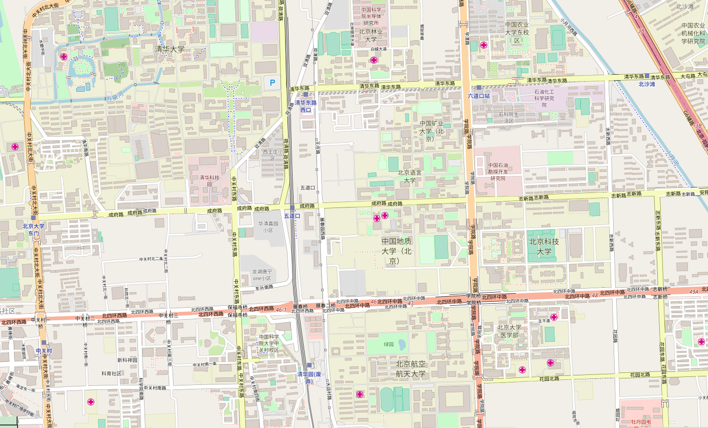

# 交互式移动通信网络分析和规划软件设计

> Interactive mobile communication network analysis and planning software design

- - -

**报告摘要**：在本课程报告中完成了一套XX软件的分析设计。基于XXX技术，采取XXX，达到了XXX效果等。要求3-5行。

**关键字**：3-5个分号分开。

- - -

软件界面、功能和报告要求如下。

## 界面要求

### 1. 顶部菜单

* 文件菜单（下设“打开数据文件”；“退出”；详见后续说明。
* 配置：弹出配置对话框，详见后续说明。
* 帮助：关于，弹出对话框，显示你的姓名学号等制作信息。

### 2. 中部，显示区域、单选、按钮等。

### 3. 底部，状态栏。


要求界面尺寸可以缩放，中部显示区域占据最大窗口面积。

## 功能要求

### 1. 用户打开地形文件，弹出“打开文件对话框”，要求正确读入建筑物文本文件，并在界面上绘图。示例的 data.txt 文件如下：

``` text
1   buildings   5
440953.419008   4428384.184299
440949.749585   4428477.168031
441019.445135   4428479.892589
441023.115406   4428386.908899
440953.419008   4428384.184299
......
注意Buildings会有很多个
......
1 basestation
440953 4428384 30 18.2
......
注意基站数据会有多个
```

其中1是序号，5是建筑物所对应的多边形的边数N+1，随后是N+1个顶点的坐标，注意首尾顶点是相同的。

坐标的单位是米，第一坐标是经度方向，第二坐标是纬度方向，其中靠北（靠西）的值较大。

绘制所有的多边形组成的城市建筑物地图。地图数据来自<https://www.openstreetmap.org/export#map=15/39.9909/116.3368>，为开源数据，测试数据显示区域为北京市。



数据后半部分是基站数据，第一行 1 basestation，其中1是编号。第二行为4个字段，第1和第2字段分别是坐标（单位：米），第1坐标是经度方向，第2坐标是纬度方向，其中靠北（靠西）的值较大。

第3字段是天线高度，（单位：米）（例子里面是30m），第4字段是天线的发射功率（例子中为18.2dBm）。

读入数据，将数据以合适的结构存储。随后，在中部绘制绘制所有的建筑物和基站，其中建筑物绘制为多边形，基站建议绘制为填充的圆形。具体配色请自行决定。

### 2. 用户可以利用放大、缩小、缩放至适合等按钮，改变上述显示内容的比例，可以观察整个区域，也可以观察局部。

建议利用鼠标滚轮、滚动条等方法或增加上下左右移动按钮，或接受用户方向键，以允许用户移动窗口显示区域。（本部分为可选项目）

### 3. 用户打开配置对话框，显示如下内容：


用户可以输入相应的数据，对于非法输入（指非数字的输入），应可以判定并提醒用户。上述值作为缺省值，存储在配置文件中，用户本次的改动，在下次打开文件时仍然可以恢复。

### 4. 覆盖率的计算

评估覆盖仅考虑RSRP，即最强信号强度。对任意一点<此处应有公式>，它收到的来自基站<此处应有公式>的信号<此处应有公式>简化计算为：<此处应有公式>

其中<此处应有公式>为基站b的发射功率（见数据文件），<此处应有公式>为路径损耗，计算如下。


<此处应有公式>为基站天线高度，<此处应有公式>为接收机（手机）高度，<此处应有公式>统一为常数1.5米。<此处应有公式>为两者距离，<此处应有公式>为工作频率，则路损为：

<此处应有公式>

其中，f的单位是MHz，<此处应有公式>单位是米，d的单位是公里，<此处应有公式>取3dB，计算结果单位为dB。

RSRP为每个位置最强的基站信号强度，若RSRP大于门限则认为被覆盖。

用户选择“覆盖情况”，点击分析时，应计算区域内的覆盖情况，并用不同的颜色绘制不同的覆盖状态（即RSRP值），颜色可以自定义。

### 5. 下行最大速率的计算（本部分物联网专业为可选项目）

根据香农公式计算最大速率，其中信噪比SNR按如下方法计算：

  1. 信号为最强基站信号，即RSRP
  2. 噪声为热噪声功率（单位Hz的功率乘以带宽，见对话框输入）与其他基站到该点的功率之和。
  3. 带宽为对话框输入的带宽。

用户选择“下行最大速率时”，点击分析时，应计算区域内的覆盖情况，并用不同的颜色绘制不同的下行最大速率值，颜色可以自定义。

## 报告要求

1. 本课程报告满分为50分，要求完成具有一定规模和综合度的软件，完成软件文档和报告，字数不少于5000字（一般不低于15页），代码行一般不低于2000行。作业同时提交纸质版和电子版（发至信箱）。

2. 报告的内容包括摘要、目录、概要设计、详细设计、关键代码说明，测试和代码迭代过程、运行截图，结论等部分。附完整的代码。如果有参考文献应在附录给出参考文献。

3. 报告应呈现出代码的迭代改进和版本管理过程，作者对自身代码的优缺点分析，指出未来改进方向等，同时在总结中需要包含心得体会和软件设计感悟。

4. 报告应严格地按照本文档模板完成。

5. 编程语言不限，但建议采取Python、C#或Matlab完成。

6. 得分包括两个部分：（a）代码质量，包括代码的可读性、可维护性等、软件工具使用情况（如版本管理）等；（b）报告文本质量，包括报告结构清晰、内容详实、文字流畅、图表规范、论述合理、结论正确等方面的要求。

7. 严禁抄袭，否则根据情况扣分直至取消成绩。同时，在不抄袭的情况下，提倡对给予自己帮助人应在“致谢”部分予以谢意。

## 参考资料

* [Qt中QMainWindow, QWidget以及QDialog的区别和选择](https://blog.csdn.net/Mengwei_Ren/article/details/71305885)

* [PyQt4 学习笔记](https://blog.csdn.net/Kai_gai/article/details/49535335)